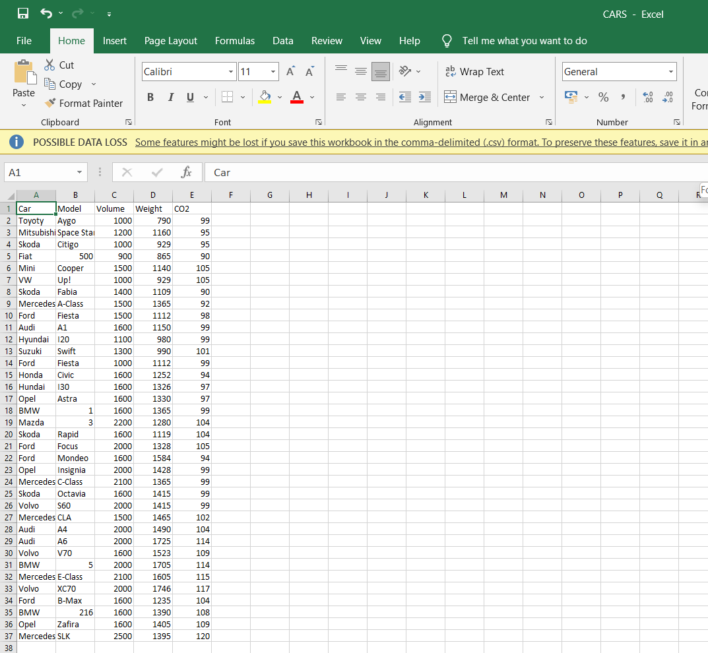
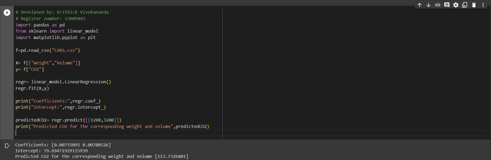

# Implementation of Multivariate Linear Regression
## Aim
To write a python program to implement multivariate linear regression and predict the output.
## Equipment’s required:
1.	Hardware – PCs
2.	Anaconda – Python 3.7 Installation / Moodle-Code Runner
## Algorithm:
### Step1:
Import the pandas and scikit-learn libraries.

### Step2:
Read the data from the csv file.

### Step3:
Split the data into features (X) and target(y).

### Step4:
Create and fit the linear linear regression model.

### Step5:
Print the coefficients and intercepts of the linear regression model.

### Step6:
Make a prediction.

### Step7:
Print the predicted CO2 emissions.

### Step8:
End the Program.

## Program:
```python
# Develpoed by: Krithick Vivekananda
# Register number: 23009445
import pandas as pd
from sklearn import linear_model
import matplotlib.pyplot as plt

f=pd.read_csv("CARS.csv")

X= f[["Weight","Volume"]]
y= f["CO2"]

regr= linear_model.LinearRegression()
regr.fit(X,y)

print("Coefficients:",regr.coef_)
print("Intercept:",regr.intercept_)

predictedCO2= regr.predict([[1200,3200]])
print("Predicted CO2 for the corresponding weight and volume",predictedCO2)


```
## Output:
1) Spreadsheet 



2) Output




## Result
Thus the multivariate linear regression is implemented and predicted the output using python program.